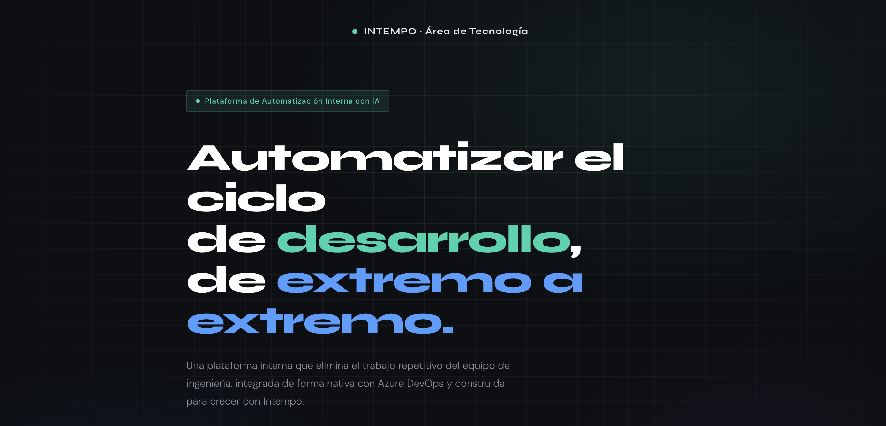
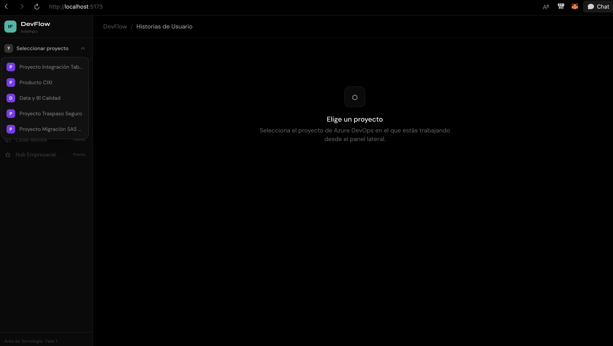
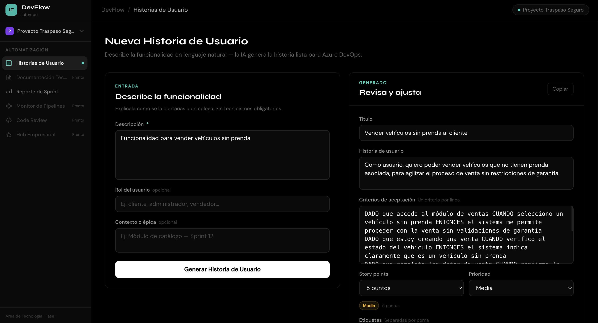
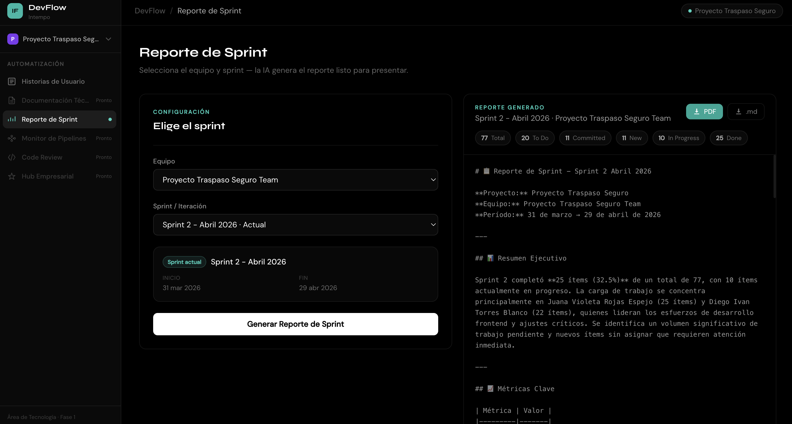

<div align="center">



# DevFlow · Intempo

**Plataforma interna de automatización del ciclo de desarrollo con IA**

[](https://nodejs.org)
[](https://react.dev)
[](https://anthropic.com)
[](https://dev.azure.com)
[](#)

[Descripción](#-descripción) · [Módulos](#-módulos) · [Stack](#-stack-tecnológico) · [Instalación](#-instalación) · [Variables de entorno](#-variables-de-entorno) · [Roadmap](#-roadmap)

</div>

---

## ✦ Descripción

DevFlow es una plataforma web interna que elimina el trabajo repetitivo del equipo de ingeniería de Intempo integrando IA directamente en el flujo de Azure DevOps.

En lugar de redactar historias de usuario manualmente, compilar reportes de sprint a mano o depender de herramientas genéricas, DevFlow genera todo en segundos a partir de descripciones en lenguaje natural — y lo publica directamente en Azure Boards con un clic.

> Construido sobre el proceso real de Intempo. El conocimiento se queda en la empresa.

<br />

<div align="center">

</div>

---

## ⬡ Módulos

| # | Módulo | Estado | Descripción |
|---|--------|--------|-------------|
| 01 | **Historias de Usuario** | ✅ Activo | Genera historias completas con criterios de aceptación y las publica como Work Items en Azure Boards |
| 02 | Documentación Técnica | 🔜 Próximo | Genera READMEs y documentación de API directamente desde Azure Repos |
| 03 | **Reporte de Sprint** | ✅ Activo | Genera reportes ejecutivos de sprint con métricas, distribución del equipo y exportación a PDF |
| 04 | Monitor de Pipelines | 🔜 Próximo | Alertas inteligentes de CI/CD con sugerencias de resolución |
| 05 | Code Review | 🔜 Próximo | Revisión automática de Pull Requests en Azure Repos |
| 06 | Hub Empresarial | 🔜 Próximo | Orquestación multi-sistema con integración al CRM |

---

## 📸 Capturas

<div align="center">

| Módulo 01 — Historias de Usuario | Módulo 03 — Reporte de Sprint |
|:-:|:-:|
|  |  |

</div>

---

## 🛠 Stack Tecnológico

**Frontend**
- React 18 + Vite
- Tailwind CSS
- Marked (renderizado Markdown → PDF)

**Backend**
- Node.js + Express (ES Modules)
- Anthropic SDK — Claude Haiku

**Integración**
- Azure DevOps REST API v7.1
  - Azure Boards (Work Items, Iterations)
  - Azure Repos (repositorios, árbol de archivos)

---

## ⚙ Instalación

Clona el repositorio e instala las dependencias de cada servicio:

```bash
# Backend
cd backend
npm install
cp .env.example .env   # Configura tus credenciales

# Frontend
cd ../frontend
npm install
```

**Levantar en desarrollo:**

```bash
# Terminal 1 — Backend (puerto 3001)
cd backend && npm run dev

# Terminal 2 — Frontend (puerto 5173)
cd frontend && npm run dev
```

Abre [http://localhost:5173](http://localhost:5173)

---

## 🔑 Variables de entorno

Crea `backend/.env` a partir de `backend/.env.example`:

```env
# Anthropic
ANTHROPIC_API_KEY=sk-ant-...

# Azure DevOps
AZURE_DEVOPS_ORG=intempo-labs
AZURE_DEVOPS_PROJECT=NombreDelProyecto
AZURE_DEVOPS_PAT=tu_personal_access_token
AZURE_DEVOPS_WORK_ITEM_TYPE=Task

# Servidor
PORT=3001
```

**Permisos requeridos en el PAT de Azure DevOps:**

| Scope | Permiso |
|-------|---------|
| Work Items | Read & Write |
| Code | Read |
| Project and Team | Read |

---

## 🗺 Roadmap

```
Fase 1 — Semanas 1-2   ████████████████  Módulos 01 y 03  ✅
Fase 2 — Semanas 3-8   ░░░░░░░░░░░░░░░░  Módulos 02, 04
Fase 3 — Semanas 9-14  ░░░░░░░░░░░░░░░░  Módulo 05
Fase 4 — Mes 4-6       ░░░░░░░░░░░░░░░░  Módulo 06
```

---

## 📁 Estructura del proyecto

```
devflow-intempo/
├── backend/
│   ├── src/
│   │   ├── routes/          # generate, devops, repos, docs, sprint
│   │   ├── prompts/         # Prompts de Claude por módulo
│   │   └── index.js         # Servidor Express
│   └── .env.example
├── frontend/
│   └── src/
│       ├── components/      # StoryForm, StoryOutput, SprintReport, DocGenerator
│       └── App.jsx          # Layout con sidebar + routing de módulos
└── propuesta-ia-intempo.html
```

---

<div align="center">

**Intempo · Área de Tecnología**

*Plataforma de Automatización del Ciclo de Desarrollo · Fase 1 · 2025*

</div>
